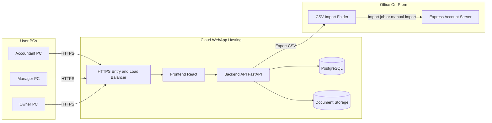

# Architecture Overview — AI Pre-Accounting Copilot

## Infrastructure & User Access Model (Customer View)

This platform is hosted on cloud as a web application. Accountants, Managers, and Owners access it from their own PCs through a browser via HTTPS. Documents are opened from each user's local machine and uploaded to the cloud webapp. After review and approval, result CSV files are exported and imported into Express Account running on an on-prem server in the office.

### High-Level Network Design



### Role-Based Usage Flow

1. Accountant: opens local invoice files and uploads via HTTPS webapp, then reviews extraction and mapping.
2. Manager: reviews process quality, mismatches, and approval status from the dashboard.
3. Owner: monitors summary KPIs and export status.
4. Approved batch is exported as Express-compatible CSV and consumed by Express Account on the office server.

## System Design

```
┌─────────────────────────────────────────────────────────────┐
│                    User (Accountant)                         │
└────────────────────┬────────────────────────────────────────┘
                     │ Browser
┌────────────────────▼────────────────────────────────────────┐
│              Frontend (React + TypeScript)                   │
│  ┌─────────────────────────────────────────────────────┐    │
│  │ Pages:                                              │    │
│  │  • Upload (drag-drop)                              │    │
│  │  • Dashboard (processing status)                   │    │
│  │  • Review (field editor + validation)              │    │
│  │  • Export (Excel download)                         │    │
│  │  • Settings (user management)                      │    │
│  └─────────────────────────────────────────────────────┘    │
└────────────────────┬────────────────────────────────────────┘
                     │ REST API
┌────────────────────▼────────────────────────────────────────┐
│           FastAPI Backend (Python 3.12)                      │
│  ┌────────────────────────────────────────────────────┐     │
│  │ API Layer                                          │     │
│  │  • POST /documents/upload                          │     │
│  │  • GET /documents/{id}                             │     │
│  │  • PUT /documents/{id}/approve                     │     │
│  │  • GET /documents/{id}/export                      │     │
│  │  • GET /extractions/{id}                           │     │
│  └────────────────────────────────────────────────────┘     │
│  ┌────────────────────────────────────────────────────┐     │
│  │ Service Layer                                      │     │
│  │  • DocumentService (CRUD, status tracking)         │     │
│  │  • ExtractionService (process & store results)     │     │
│  │  • AuditService (log all changes)                  │     │
│  │  • ExportService (Excel generation)                │     │
│  └────────────────────────────────────────────────────┘     │
│  ┌────────────────────────────────────────────────────┐     │
│  │ ML Pipeline (Processing)                           │     │
│  │  • OCR Module                                      │     │
│  │    └─ Tesseract or AWS Textract                   │     │
│  │  • Classification Module                           │     │
│  │    └─ Claude API (few-shot)                        │     │
│  │  • Extraction Module                               │     │
│  │    └─ Claude API (structured extraction)           │     │
│  │  • Validation Module                               │     │
│  │    └─ Rule engine (custom rules)                   │     │
│  │  • Confidence Scoring                              │     │
│  │    └─ Flag low-confidence for human review         │     │
│  └────────────────────────────────────────────────────┘     │
└────────────────────┬────────────────────────────────────────┘
                     │
        ┌────────────┼────────────┐
        │            │            │
     ┌──▼──┐    ┌───▼──┐   ┌────▼────┐
     │ DB  │    │Cache │   │External  │
     │(PG) │    │(Redis)   │Services  │
     │     │    │      │   │          │
     │ TB: │    │      │   │• Claude  │
     │ •Docs   │      │   │  API     │
     │ •Extract│      │   │• Textract│
     │ •Audit │       │   │(or Tesla)
     │ •Users  │      │   └──────────┘
     │ •Rules  │      │
     └──────┘    └──────┘
```

## Data Flow

### COA Mapping Strategy (Technical)

The platform uses a shared multi-tenant mapping approach for accounting offices that manage many client companies.

1. Each client company keeps its own Chart of Accounts profile and mapping metadata.
2. COA structures and mapping examples are indexed as vectors in a shared retrieval layer.
3. At runtime, the processing pipeline loads company context by company ID and retrieves only relevant COA candidates.
4. The extraction prompt is composed dynamically using retrieved COA context and document signals.
5. Mapping output is validated against company-specific rules before presenting results to human review.

This design avoids per-company model retraining, reduces operating cost, and scales to large accounting offices while preserving company-level mapping behavior.

### COA Mapping Runtime Flow

```text
Document + Company ID
  -> OCR text
  -> Retrieve company COA context (vector + metadata)
  -> Dynamic prompt composition
  -> Field extraction + account mapping
  -> Rule validation
  -> Human review (if low confidence or rule mismatch)
```

### 0. End-to-End User and Network Flow

```text
User PC (Accountant/Manager/Owner)
  ↓ HTTPS
Cloud WebApp
  ↓ Process and review
CSV export
  ↓
Office on-prem Express Account Server
```

### 1. Document Upload
```
User (Browser)
  ↓
[POST /documents/upload] → FastAPI
  ↓
Validate file (PDF/image)
  ↓
Store in S3/file server
  ↓
Create Document record (status: UPLOADED)
  ↓
Return document_id to frontend
```

### 2. Document Processing
```
Background Job / Queue
  ↓
[1. OCR]
  Document image → Tesseract/Textract → OCR text
  ↓
[2. Classification]
  OCR text + document metadata → Claude → Document type
  (invoice, bill, receipt, etc.)
  ↓
[3. Field Extraction]
  OCR text + document type → Claude (structured prompt)
  → JSON with extracted fields
  ↓
[4. Validation]
  Run validation rules engine
  → Flag errors/warnings
  → Calculate confidence scores
  ↓
[5. Confidence Check]
  If confidence < 75% → flag for human review
  Status: PENDING_REVIEW
  ↓
[6. Store Results]
  Save to Extraction record
  Create AuditLog entries
```

### 3. Human Review
```
Accountant opens document
  ↓
See extracted fields + confidence scores
  ↓
Edit fields as needed
  ↓
Validate against rules
  ↓
Approve / Reject
  ↓
Save changes (audit trail)
  ↓
Status: APPROVED / REJECTED
```

### 4. Export
```
Accountant clicks "Export Selected"
  ↓
[POST /export] with document_ids
  ↓
Generate Excel file
  ├─ Metadata sheet (document info, approval date, approver)
  ├─ Extractions sheet (all fields)
  └─ Audit log sheet (change history)
  ↓
Return .xlsx file
```

## Database Schema (Simplified)

```sql
-- Documents
CREATE TABLE documents (
    id UUID PRIMARY KEY,
    filename TEXT,
    original_file_path TEXT,
    document_type VARCHAR(50),  -- invoice, bill, receipt
    status VARCHAR(50),         -- uploaded, processing, pending_review, approved, rejected
    upload_date TIMESTAMP,
    uploaded_by UUID,           -- FK to users
    approved_by UUID,           -- FK to users (nullable)
    created_at TIMESTAMP,
    updated_at TIMESTAMP
);

-- Extractions
CREATE TABLE extractions (
    id UUID PRIMARY KEY,
    document_id UUID,           -- FK to documents
    extraction_json JSONB,      -- {vendor_name, invoice_date, amount, ...}
    confidence_scores JSONB,    -- {vendor_name: 0.95, amount: 0.87, ...}
    validation_errors JSONB,    -- [{field: 'amount', error: 'mismatch with total'}]
    status VARCHAR(50),         -- extracted, approved, exported
    created_at TIMESTAMP,
    updated_at TIMESTAMP
);

-- Audit Log
CREATE TABLE audit_logs (
    id UUID PRIMARY KEY,
    document_id UUID,
    action VARCHAR(50),         -- extracted, edited, approved
    changed_fields JSONB,       -- {old: {...}, new: {...}}
    changed_by UUID,            -- FK to users
    timestamp TIMESTAMP
);

-- Validation Rules
CREATE TABLE validation_rules (
    id UUID PRIMARY KEY,
    document_type VARCHAR(50),
    field_name TEXT,
    rule_type VARCHAR(50),      -- required, regex, numeric_range, custom
    rule_config JSONB,          -- {pattern: '...', min: 0, max: 1000000}
    enabled BOOLEAN,
    created_at TIMESTAMP
);

-- Users
CREATE TABLE users (
    id UUID PRIMARY KEY,
    username TEXT UNIQUE,
    email TEXT UNIQUE,
    password_hash TEXT,
    role VARCHAR(50),           -- admin, reviewer
    created_at TIMESTAMP,
    last_login TIMESTAMP
);
```

## API Endpoints (Core)

### Documents
```
POST   /api/documents/upload
GET    /api/documents
GET    /api/documents/{id}
PUT    /api/documents/{id}/approve
DELETE /api/documents/{id}

POST   /api/documents/{id}/export
```

### Extractions
```
GET    /api/documents/{id}/extraction
PUT    /api/documents/{id}/extraction
POST   /api/documents/{id}/extraction/validate
```

### Audit Trail
```
GET    /api/documents/{id}/audit-log
GET    /api/audit-log (global)
```

### Rules
```
GET    /api/rules
POST   /api/rules
PUT    /api/rules/{id}
DELETE /api/rules/{id}
```

### Users
```
POST   /api/auth/login
POST   /api/auth/logout
GET    /api/users
POST   /api/users (admin only)
PUT    /api/users/{id}
DELETE /api/users/{id}
```

## Technology Choices & Rationale

| Component | Tech | Why |
|-----------|------|-----|
| API | FastAPI | Async-first, built-in OpenAPI docs, fast, modern Python |
| Database | PostgreSQL | JSONB for flexible extraction results, ACID compliant, reliable |
| Cache | Redis | Fast in-memory for processing queues, session management |
| Frontend | React 18 | Component-based, large ecosystem, TypeScript support |
| LLM | Claude API | Best-in-class accuracy for structured extraction, batch API available |
| OCR | Tesseract (default) | Free/open-source; AWS Textract as premium option |
| Async Jobs | Celery or Python-RQ | Background processing for OCR/LLM tasks |
| File Storage | S3 or local FS | S3 for prod, local for dev/testing |
| Testing | pytest + Vitest | Industry standard, good coverage reporting |

## Deployment Strategy

### Development
- Docker Compose (local, all services in one file)
- Hot reload for backend + frontend
- Real PostgreSQL (not SQLite)

### Production
- Backend: ECS/K8s with auto-scaling
- Frontend: S3 + CloudFront (or Nginx static)
- Database: RDS PostgreSQL (managed)
- Cache: ElastiCache Redis
- File Storage: S3 with lifecycle policies
- CI/CD: GitHub Actions → build → test → deploy (via Openclaw)

### Office Integration (Express On-Prem)
- Express Account remains installed on office on-prem server.
- CSV from this platform is delivered to a controlled import path (manual or automated transfer).
- Office IT defines import schedule and retry policy.
- Integration logs must capture import timestamp, file name, and success/failure status.

## Error Handling & Logging

```python
# All API errors follow standard format
{
    "error": "invalid_document",
    "message": "Uploaded file is not a valid PDF or image",
    "request_id": "req_1234567890",
    "timestamp": "2026-06-02T10:30:00Z"
}

# Structured logging (JSON)
{
    "level": "INFO",
    "timestamp": "2026-06-02T10:30:00Z",
    "service": "document_processor",
    "event": "extraction_completed",
    "document_id": "doc_abc123",
    "confidence": 0.92,
    "processing_time_ms": 1250,
    "user_id": "usr_def456"
}
```

## Performance Targets (MVP)

| Metric | Target |
|--------|--------|
| API response time | <500ms (upload), <200ms (list/get) |
| Document processing | <30s per document (OCR + extraction + validation) |
| Export time | <5s for 100 documents |
| Concurrent users | 100+ (with Redis caching) |
| Database query time | <100ms (p95) |
| Availability (SLA) | 99% uptime |

