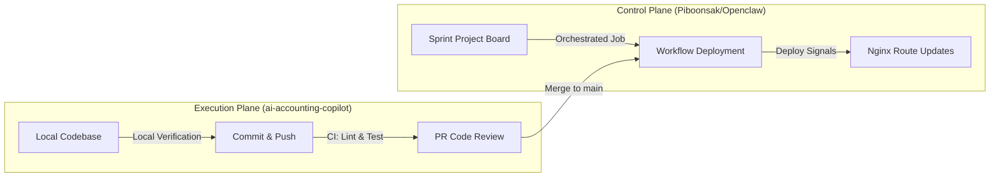
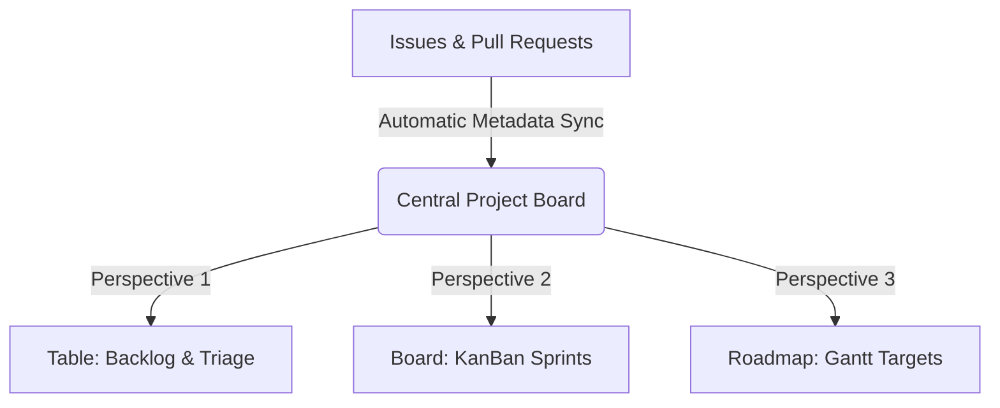

# Design Control & CI/CD Process Guide

This document defines the development lifecycle, quality gates, and automated integration standards for the **AI Pre-Accounting Copilot** (`ai-accounting-copilot`). It integrates workspace governance policies with GitHub Projects Best Practices to establish a reliable release pipeline.

---

## ⛔ 1. Workspace Governance & The Hybrid Two-Plane Model

To manage infrastructure security and safeguard cloud costs, we separate development actions into two planes:



* **Control Plane (`Piboonsak/Openclaw`)**: Manages the master sprint Gantt roadmap, repository coordination, release triggers, structural Nginx proxies, and secure production credentials. Deploys to Hostinger VPS *only* initiate from here.
* **Execution Plane (`ai-accounting-copilot`)**: Contains the application code, the OCR Python processor, the double-entry matching rules, integration APIs, and local unit tests.

### Non-Negotiable Enforcement Rules

* **No Direct VPS Modifications**: All additions to the production sandbox must live in the codebase and deploy via GitHub Actions. Direct SSH-to-VPS commands that create, delete, or modify assets are strictly forbidden.
* **SSH Diagnostic Limit**: SSH connections are authorized strictly for *read-only* diagnostic triage (`docker logs`, `docker ps`, `get config`).

---

## 🛡️ 2. Verification Gates & Local Pre-Commit Hooks

We utilize local git hooks to control runaway agent loops and verify code quality before code transitions to the remote server.

```text
       [Developer Draft]
               │
               ▼  (git commit)
      ┌─────────────────┐
      │   Git Commit    │
      │ Precheck Hook   │
      └────────┬────────┘
               │
       [Gate Checks Run]
               │
       ┌───────┴───────┐
       ▼               ▼
   [Passed]         [Failed]
       │               │
       ▼               ▼
 [Check-in Ok]   [Block Commit]
```

### The 4 Hard Gates (in `scripts/check_evidence.py`)

1. **Scope & Loop Defuser**: Monitors `.agent/state/*.json` counters. If an agent loops over **5 times** on a single tick without finishing, the task shifts to `BLOCKED` and execution stops.
2. **Deterministic Evidence**: Commits affecting `src/` or `tests/` are aborted unless a raw execution console run or screenshot is saved under `.agent/evidence/`.
3. **Minimum Action Enforcement**: Blocks commits containing only document plan enhancements (`.md` edits). Updates must contain functional code modifications under code directories.
4. **Integration Safety**: Restricts staging configuration profiles (`docker-compose.prod.yml`, `nginx-root.conf`) in the execution repository to prevent cross-contamination.

---

## 🚦 3. Issue Routing, Risk Levels & QA Gating

Before starting active development, all tickets are labeled based on their expected risk footprint to dictate downstream testing gates:

| Risk Category | Criteria | QA Integration Requirements | Merge Gate |
| :--- | :--- | :--- | :--- |
| **LOW** | Layout tweaks, text translations, documentation patches | Unit tests, local styling check | Auto-Merge upon green test success |
| **MEDIUM** | Dynamic selectors, COA rules YAML logic updates | Full unit-test suite, Playwright interface verification | Auto-Merge upon green test success |
| **HIGH** | OCR scanning core, prompt adjustments, DB schema migrations | Cohort accuracy validator runs, custom database integration tests | **Manual Human Approval** (`approved-by-human` label required) |
| **CRITICAL** | API endpoint structures, multi-party routing, key config keys | Full continuous integration runs, security schema checks | **Manual Human Approval** and lead administrator override |

---

## 📊 4. Core GitHub Project Board Architecture (Best Practices)

Following GitHub Project's guide on *Planning and Tracking with Projects*, we configure the central workspace to serve as the unified team **Single Source of Truth**.



### 4.1 Metadata & Custom Field Mappings

Each issue card on the board utilizes standard GitHub properties synchronized automatically with dynamic custom fields:

1. **Status (Single Select)**: Controls the column flow:
   * `Backlog` (Triaged items)
   * `Investigate` (Mandatory checklist lookup)
   * `Ready for Trial` (Approved with `status:ready`)
   * `In Progress` (Development)
   * `Review` (PR Opened)
   * `Done` (Merged and deployed safely)
2. **Priority (Single Select)**: `Low` | `Medium` | `High` | `Critical`.
3. **Complexity (Number Field)**: Task complexity or story weight.
4. **Target Shipment (Date Field)**: Tracks chronological delivery dates.
5. **Iteration (Sprint Field)**: Plans 2-week delivery slots with scheduled team breaks.
6. **Milestone (GitHub Standard)**: Groups tasks into release boundaries (`v0.1-PoC`, `v0.2-MVP`).

### 4.2 Board Workflows & Perspectives

We implement 3 specialized, pre-saved views inside the project board to look at our data from different angles:

* **View 1: Column Triage (High-Efficiency Table)**
  * *Filter*: `is:issue -status:Done`
  * *Group By*: `Milestone`
  * *Sort By*: `Target Shipment` (Earliest first)
  * *Purpose*: Used during backlog grooming to evaluate timelines and prevent bottlenecks.
* **View 2: Iteration Sprint Board (KanBan Layout)**
  * *Layout*: Card Board
  * *Group By*: `Status`
  * *Filter*: Active Iteration Sprint
  * *Column Limit*: Limits maximum tasks in `In Progress` column to maintain developer focus.
* **View 3: Delivery Roadmap (Gantt Timeline)**
  * *Layout*: Roadmap
  * *X-Axis*: `Target Shipment` or Sprint timelines
  * *Group By*: `Issue Scope` (e.g. `channel-layer`, `agent-runtime`, `ux-ui`)
  * *Purpose*: High-level timeline shared with stakeholders to communicate progress transparently.

---

## ⚙️ 5. Automated CI/CD Lifecycle & Continuous Validation

Deployments follow an automated lifecycle to ensure code in main is always stable and verified:

```text
[Local commit passes Check] -> [Push to Git] -> [Continuous Integration Executed]
                                                       │
                                               [Unit/Linter Checks]
                                                       │
                                            [PR merged to main branch]
                                                       │
                                         [Control Plane Workflow Trigger]
                                                       │
                                                 [Docker Build]
                                                       │
                                          Nginx re-route & Health checks
```

1. **Continuous Testing**: Code commits trigger PR-checks validating formatting (`ruff`), typescript checks (`tsc`), and unit suites (`pytest`).
2. **Auto Deployment (5-Minute Rule)**: Once a PR (`Risk: Low/Medium`) merges, a trigger command dispatches to the Control Plane `deploy-openclaw-github-private-secrets.yml` to pull images, map sandbox directories, and run health verifications.
3. **Deployment proof requirement**: No issue card can transition to `Done` without attaching:
   * The deploy GHA workflow URL.
   * The deployed Git commit SHA.
   * The output report of the **22-point automated health check**.

---

## 🌐 6. Demo Site Deployment (Branch `demo`)

To deliver clickable preview builds safely, demo deployments are run from the **Control Plane** (`Piboonsak/Openclaw`) and pull source from `YAHWAN-SHOP/ai-accounting-copilot` branch `demo`.

### Demo Infrastructure

* **Domain:** `demo-aiaccount.yahwan.biz`
* **VPS:** `76.13.210.250`
* **Remote web root:** `/var/www/demo-aiaccount`
* **Nginx conf:** `/etc/nginx/conf.d/demo-aiaccount.conf`
* **Content:** static prototype (`ux-ui-prototype.html` + `ux-ui-prototype.css`)

### Deploy Flow

1. Push code to branch `demo` in `YAHWAN-SHOP/ai-accounting-copilot`.

2. Trigger Control Plane workflow `deploy-ai-accounting-copilot-demo.yml` in `Piboonsak/Openclaw` (manual or orchestrated dispatch).

3. Workflow deploy job performs SCP upload of HTML/CSS and nginx config.

4. Workflow deploy job runs `nginx -t`, `systemctl reload nginx`, and host-header health check (`HTTP 200` expected).

5. Workflow verify job performs Playwright post-deploy smoke checks against live demo URL.

### Post-Deploy Playwright Checks (Required)

* Page loads successfully with expected title.
* Main interactive UI renders (topbar + stepper + action buttons).
* Core click path works (open page, click key controls, no broken state).
* No console `error` messages.
* Screenshot artifact uploaded for visual regression reference.

### Required Secrets (Control Plane)

* `VPS_HOST`
* `VPS_USER`
* `VPS_SSH_KEY` (or equivalent deploy key secret)
* `GH_TOKEN` (read access to target repo branch)

### Rollback

Rollback is commit-based: redeploy a known-good commit from `demo` branch through the same workflow. No direct VPS mutation outside workflow execution.
