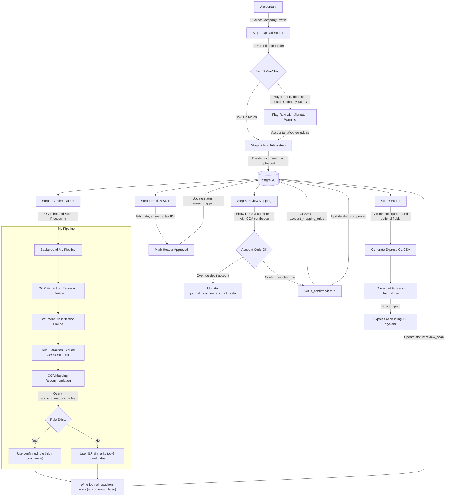
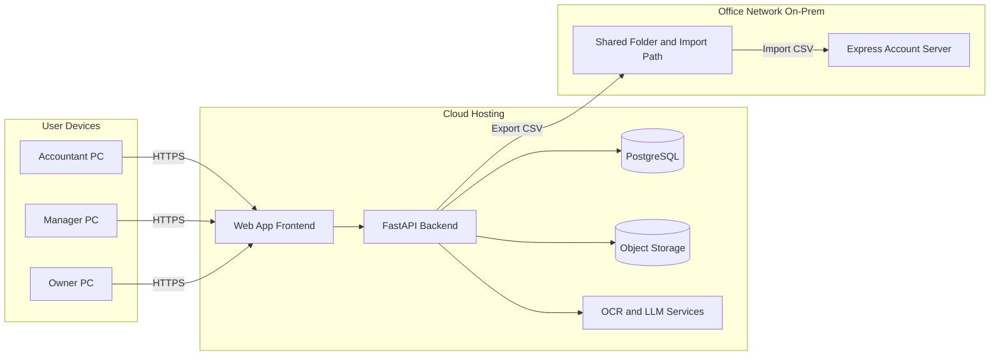

# Mapping Architecture: Double-Entry COA Mapping & Express GL Export

> **Status**: Approved for implementation  
> **Last updated**: 2026-06-02  
> **Scope**: Multi-company pre-accounting pipeline — Upload → OCR → COA Mapping → HITL Review → Express GL Export

---

## Table of Contents

1. [System Overview](#1-system-overview)
2. [Database Schema](#2-database-schema)
3. [Data Flow Diagram](#3-data-flow-diagram)
4. [ML Feedback Loop Protocol](#4-ml-feedback-loop-protocol)
5. [UX/UI Page Specifications](#5-uxui-page-specifications)
6. [Express GL CSV Format](#6-express-gl-csv-format)
7. [Double-Entry Standard (Thai Accounting)](#7-double-entry-standard-thai-accounting)
8. [Key Design Decisions](#8-key-design-decisions)
9. [Deployment & On-Prem Integration](#9-deployment--on-prem-integration)
10. [Security & HTTPS Model](#10-security--https-model)

---

## 1. System Overview

The AI Pre-Accounting Copilot processes scanned accounting documents (invoices, bills, receipts) through a 7-step pipeline:

```
Company Select → Upload (with Tax ID pre-check) → Confirm Queue
  → Process (OCR + ML) → Review Scan → Review Mapping → Export
```

**Core capabilities added in this version:**

| Capability | Description |
|---|---|
| Multi-company | Each upload session is scoped to a chosen company; COA is per-company |
| Tax ID pre-check | Buyer Tax ID extracted from document header is matched against selected company Tax ID before processing |
| Split HITL review | Step 4 = scan accuracy review; Step 5 = double-entry COA mapping review |
| ML reinforcement | Accountant confirms/overrides account codes → rules stored → used for future auto-recommendations |
| Express GL export | Multi-row JV-style CSV matching Express Accounting GL Voucher import format |
| Settings panel | Add companies, import COA CSV per company |

---

## 2. Database Schema

### 2.1 `companies` — Company Profiles

```sql
CREATE TABLE companies (
    id          UUID PRIMARY KEY DEFAULT gen_random_uuid(),
    name        VARCHAR(255) NOT NULL,
    tax_id      VARCHAR(13) UNIQUE NOT NULL,   -- 13-digit Thai Tax ID
    address     TEXT,
    created_at  TIMESTAMP DEFAULT CURRENT_TIMESTAMP,
    updated_at  TIMESTAMP DEFAULT CURRENT_TIMESTAMP
);
```

### 2.2 `chart_of_accounts` — COA per Company

```sql
CREATE TABLE chart_of_accounts (
    id            UUID PRIMARY KEY DEFAULT gen_random_uuid(),
    company_id    UUID REFERENCES companies(id) ON DELETE CASCADE,
    account_code  VARCHAR(50) NOT NULL,   -- e.g., '1001', '5045'
    account_name  VARCHAR(150) NOT NULL,  -- e.g., 'เงินสด', 'ค่าเช่า'
    account_type  VARCHAR(50),            -- asset | liability | equity | revenue | expense
    is_active     BOOLEAN DEFAULT TRUE,
    created_at    TIMESTAMP DEFAULT CURRENT_TIMESTAMP,
    UNIQUE (company_id, account_code)
);
```

### 2.3 `documents` — Document Metadata (Expanded)

```sql
CREATE TABLE documents (
    id                UUID PRIMARY KEY DEFAULT gen_random_uuid(),
    company_id        UUID REFERENCES companies(id),      -- Target company (set before upload)
    filename          VARCHAR(255) NOT NULL,
    original_file_path TEXT NOT NULL,
    document_type     VARCHAR(50),                        -- Invoice | Receipt | Payment Slip | Bill
    status            VARCHAR(50) NOT NULL,
    -- Status lifecycle: uploaded → processing → review_scan → review_mapping → approved → exported
    upload_date       TIMESTAMP DEFAULT CURRENT_TIMESTAMP,
    uploaded_by       UUID,
    buyer_tax_id      VARCHAR(13),   -- Extracted from document header
    buyer_name        VARCHAR(255),
    seller_tax_id     VARCHAR(13),
    seller_name       VARCHAR(255),
    invoice_date      DATE,
    net_amount        NUMERIC(12, 2) DEFAULT 0,   -- Base amount before VAT
    vat_amount        NUMERIC(12, 2) DEFAULT 0,   -- VAT 7%
    has_vat           BOOLEAN DEFAULT FALSE,
    vat_rate          NUMERIC(5, 2) DEFAULT 7.00,
    wht_amount        NUMERIC(12, 2) DEFAULT 0,   -- Withholding tax amount
    wht_rate          NUMERIC(5, 2) DEFAULT 0.00, -- 1%, 3%, 5%
    discount_amount   NUMERIC(12, 2) DEFAULT 0,
    gross_amount      NUMERIC(12, 2) DEFAULT 0,   -- Total payable
    taxid_match       BOOLEAN,                    -- NULL=unchecked, TRUE=match, FALSE=mismatch
    created_at        TIMESTAMP DEFAULT CURRENT_TIMESTAMP,
    updated_at        TIMESTAMP DEFAULT CURRENT_TIMESTAMP
);
```

### 2.4 `account_mapping_rules` — ML Training Dataset

```sql
CREATE TABLE account_mapping_rules (
    id                    UUID PRIMARY KEY DEFAULT gen_random_uuid(),
    company_id            UUID REFERENCES companies(id) ON DELETE CASCADE,
    vendor_name           VARCHAR(255) NOT NULL,
    document_type         VARCHAR(50),
    recommended_debit_code VARCHAR(50),     -- Expense account code e.g., '5045'
    confirmed_count       INTEGER DEFAULT 1,
    last_confirmed_at     TIMESTAMP DEFAULT CURRENT_TIMESTAMP,
    UNIQUE (company_id, vendor_name, document_type)
);
```

> **Note**: On each accountant approval in Step 5, this table is UPSERTed:
> - If rule exists → `confirmed_count += 1`, `last_confirmed_at = NOW()`
> - If no rule → INSERT new row with `confirmed_count = 1`

### 2.5 `journal_vouchers` — Double-Entry Voucher Lines

```sql
CREATE TABLE journal_vouchers (
    id            UUID PRIMARY KEY DEFAULT gen_random_uuid(),
    document_id   UUID REFERENCES documents(id) ON DELETE CASCADE,
    voucher_no    VARCHAR(50),           -- e.g., AP2605001
    voucher_date  DATE NOT NULL,
    account_code  VARCHAR(50) NOT NULL,
    is_debit      BOOLEAN NOT NULL,      -- TRUE = Debit (Dr), FALSE = Credit (Cr)
    amount        NUMERIC(12, 2) NOT NULL,
    description   TEXT,
    is_confirmed  BOOLEAN DEFAULT FALSE, -- Set to TRUE when accountant confirms in Step 5
    created_at    TIMESTAMP DEFAULT CURRENT_TIMESTAMP
);
```

---

## 3. Data Flow Diagram



---

## 4. ML Feedback Loop Protocol

### Phase 1 — Recommendation (at Processing time)

```
Input:  company_id, vendor_name, document_type
Query:  SELECT recommended_debit_code, confirmed_count
        FROM account_mapping_rules
        WHERE company_id = $1
          AND vendor_name ILIKE $2
          AND document_type = $3
        ORDER BY confirmed_count DESC
        LIMIT 1;

If rule found:   → Use recommended_debit_code as first choice (confidence: high)
If no rule:      → Run semantic similarity against chart_of_accounts.account_name
                   Return top-3 candidates ordered by cosine similarity score
```

### Phase 2 — Human Confirmation (Step 5)

- Accountant sees the recommended account code pre-selected in the combobox
- Accountant can:
  - **Accept** (click "Confirm"): confirms the recommendation as-is
  - **Override** (change combobox): selects a different account code, then confirms
- Either action triggers Phase 3

### Phase 3 — Reinforcement (on Confirm)

```sql
-- UPSERT into account_mapping_rules
INSERT INTO account_mapping_rules
    (company_id, vendor_name, document_type, recommended_debit_code, confirmed_count, last_confirmed_at)
VALUES
    ($company_id, $vendor_name, $doc_type, $confirmed_code, 1, NOW())
ON CONFLICT (company_id, vendor_name, document_type)
DO UPDATE SET
    recommended_debit_code = EXCLUDED.recommended_debit_code,
    confirmed_count        = account_mapping_rules.confirmed_count + 1,
    last_confirmed_at      = NOW();
```

> **Result**: Over time, frequently confirmed vendor→account mappings gain higher `confirmed_count` and become the default auto-suggestion, reducing accountant review effort.

---

## 5. UX/UI Page Specifications

### Design System Tokens (Impeccable)

```css
--bg:      oklch(98% 0.005 250);   /* cool white */
--surface: oklch(96% 0.006 250);   /* surface panels */
--line:    oklch(88% 0.008 250);   /* borders */
--ink:     oklch(20% 0.02 250);    /* primary text */
--muted:   oklch(50% 0.02 250);    /* secondary text */
--accent:  oklch(45% 0.15 220);    /* deep teal CTA */
--ok:      oklch(50% 0.14 155);    /* green success */
--warn:    oklch(60% 0.16 80);     /* amber warning */
--danger:  oklch(55% 0.18 25);     /* red-orange error */
```

**Typography**: DM Sans 400/500/600 (body) + JetBrains Mono 400/500 (amounts, codes, Tax IDs)  
**Banned**: cream/beige `#FCF8F0`, glassmorphism, gradient text, nested cards, bounce easing

---

### Step 1: Company Selection & Upload

**Layout**: Full-width page, two stacked sections

**Section A — Entity Selector** (required before dropzone activates)
```
┌─────────────────────────────────────────────────────┐
│ Processing for Company                              │
│ [ ▼ Select company before uploading...            ] │  ← <select> mandatory
└─────────────────────────────────────────────────────┘
```

**Section B — Dropzone** (disabled state until company selected)
```
┌─ ─ ─ ─ ─ ─ ─ ─ ─ ─ ─ ─ ─ ─ ─ ─ ─ ─ ─ ─ ─ ─ ─ ─ ┐
│       ↑   Drop files or folder here               │
│       Select a company above to enable upload     │  ← disabled state
└─ ─ ─ ─ ─ ─ ─ ─ ─ ─ ─ ─ ─ ─ ─ ─ ─ ─ ─ ─ ─ ─ ─ ─ ┘
```

**File List Row states**:
- `✓ Match` — buyer Tax ID matches selected company (subtle green badge)
- `⚠ Tax ID Mismatch` — `Doc: 0105559000999 vs Co: 0105559000123` (amber badge, requires acknowledgment)
- `○ Pending` — pre-check not yet run

---

### Step 2: Confirm File Queue

**Layout**: Hierarchical folder tree + confirm CTA

```
Folder: 2026-05-Invoices/          [✓ 10 files]
  ├─ [✓] INV-Metro-Electric-001.pdf    ✓ Match   2.1 MB
  ├─ [✓] INV-Metro-Electric-002.pdf    ✓ Match   1.8 MB
  ├─ [!] INV-Siam-Corp-005.pdf         ⚠ Mismatch  (acknowledge)
  └─ [✓] RECEIPT-2026-05-12.pdf        ✓ Match   0.9 MB

  [ ✓ Select All ]    12 files selected · 14.2 MB

  [ Confirm & Start Processing →  ]
```

---

### Step 3: Processing Progress

**Layout**: Table list with 5-stage progress per file

```
Filename                  OCR    Classify  Extract  Map COA  Status
────────────────────────────────────────────────────────────────────
INV-Metro-Electric-001    ████   ████      ████     ████     ✓ Done
INV-Metro-Electric-002    ████   ████      ████     ░░░░     ⟳ Mapping...
INV-Siam-Corp-005         ████   ░░░░      ─        ─        ⟳ Classifying...
RECEIPT-2026-05-12        ░░░░   ─         ─        ─        ⟳ OCR...
```

---

### Step 4: Review Scan Results

**Layout**: Split panel — default 50/50 (viewer/form), toggle `Wide x3` = 75/25 (viewer/form)

```
┌──────────────────────┬──────────────────────────────────────┐
│ PDF VIEWER           │  INV-Metro-Electric-001.pdf          │
│ ┌──────────────────┐ │  ──────────────────────────────────  │
│ │  [Invoice image] │ │  Invoice Date     [ 2026-05-12   ]  │
│ │  highlighted:    │ │  Invoice No       [ INV-2605-001 ]  │
│ │  ╔════════════╗  │ │  Seller Tax ID    [ 0105559111111]  │
│ │  ║ Date: ...  ║  │ │  Seller Name      [ Metro Electric] │
│ │  ║ Total: ... ║  │ │  Buyer Tax ID     [ 0105559123456]  │
│ │  ╚════════════╝  │ │  Net Amount       [ 10,000.00    ]  │
│ └──────────────────┘ │  VAT 7%           [ 700.00       ]  │
│ ◀ Prev  1/12  Next ▶ │  WHT Rate         [ 3%           ]  │
│                      │  WHT Amount       [ 300.00       ]  │
│                      │  Gross Amount     [ 10,400.00    ]  │
│                      │                                      │
│                      │  [✓] Approve Header                 │
└──────────────────────┴──────────────────────────────────────┘
```

**Multi-row selection**: Left column checkboxes for bulk approve action bar.

---

### Step 5: Review Mapping Results

**Layout**: Per-document accordion sections with Dr/Cr voucher grid

```
▼ INV-Metro-Electric-001.pdf    Vendor: Metro Electric    ฿10,700.00

  Voucher AP2605001  ·  Date: 2026-05-12

  ─────────────────────────────────────────────────────────────────────
  Dr/Cr   Account Code         Account Name           Debit      Credit
  ─────────────────────────────────────────────────────────────────────
  Dr    [ 5045 ▼ ค่าเช่า     ]  Rental Expense        10,000.00
  Dr    [ 1151 ▼ ภาษีซื้อ   ]  Input VAT 7%             700.00
  Cr    [ 2110 ▼ เจ้าหนี้   ]  Accounts Payable                  10,700.00
  ─────────────────────────────────────────────────────────────────────
                                                       10,700.00  10,700.00

  [ ✓ Confirm Mapping ]   [ ✏ Edit ]
```

The Debit account codes are `<select>` comboboxes populated from the company's COA (JetBrains Mono font). Changing a selection logs a pending ML confirm signal.

---

### Step 6: Export

**Layout**: Column configurator checklist + preview table + download CTA

```
Export Columns:
  [✓] Voucher No   [✓] Date        [✓] Book Code     [✓] Account Code
  [✓] Debit Amt    [✓] Credit Amt  [✓] Description   [✓] Company Tax ID
  [ ] Address      [✓] Seller TaxID  [✓] VAT         [✓] WHT Rate

Preview (first 5 rows):
VoucherNo   Date        BookCode  AccountCode  Debit      Credit  Description
AP2605001   2026-05-12  AP        5045         10000.00   0.00    ค่าเช่าสำนักงาน
AP2605001   2026-05-12  AP        1151         700.00     0.00    ภาษีซื้อ 7%
AP2605001   2026-05-12  AP        2110         0.00       10700.00  เจ้าหนี้การค้า

[ ↓ Download Express-Journal.CSV ]
```

---

### Settings Panel

**Access**: Gear icon in topbar — slides in as right-side panel overlay

**Section A — Companies**
```
Companies                          [ + Add Company ]
────────────────────────────────────────────────────
Name                          Tax ID           Actions
────────────────────────────────────────────────────
บริษัท ยะวัน เทค จำกัด        0105559123456    [Edit] [COA]
บริษัท ยะวัน เทรดดิ้ง จำกัด   0105559654321    [Edit] [COA]
```

**Section B — COA Import**
```
Import Chart of Accounts — บริษัท ยะวัน เทค จำกัด
Template: [ ↓ Download CSV Template ]

┌─ ─ ─ ─ ─ ─ ─ ─ ─ ─ ─ ─ ─ ─ ─ ─ ─ ─┐
│   Drop COA CSV here or click to browse  │
└─ ─ ─ ─ ─ ─ ─ ─ ─ ─ ─ ─ ─ ─ ─ ─ ─ ─┘

Expected columns: account_code, account_name, account_type
```

---

## 6. Express GL CSV Format

**Format**: GL Journal Voucher (JV style) — one row per debit or credit line

**Columns**:

| Column | Type | Example | Notes |
|---|---|---|---|
| `Voucher_No` | string | `AP2605001` | Sequential per batch |
| `Date` | YYYY-MM-DD | `2026-05-12` | Invoice date |
| `Book_Code` | string | `AP` | Accounts Payable book |
| `Account_Code` | string | `5045` | From confirmed COA mapping |
| `Debit_Amount` | decimal | `10000.00` | 0.00 if credit row |
| `Credit_Amount` | decimal | `0.00` | 0.00 if debit row |
| `Line_Description` | string | `ค่าเช่าสำนักงาน - Metro Electric` | Vendor + description |
| `Target_Company_TaxID` | string | `0105559123456` | Selected company Tax ID |

**Example output** (Purchase Invoice with VAT, no WHT):

```csv
Voucher_No,Date,Book_Code,Account_Code,Debit_Amount,Credit_Amount,Line_Description,Target_Company_TaxID
AP2605001,2026-05-12,AP,5045,10000.00,0.00,ค่าเช่าสำนักงาน - Metro Electric,0105559123456
AP2605001,2026-05-12,AP,1151,700.00,0.00,ภาษีซื้อ 7% - Metro Electric,0105559123456
AP2605001,2026-05-12,AP,2110,0.00,10700.00,เจ้าหนี้การค้า - Metro Electric,0105559123456
AP2605002,2026-05-13,AP,5020,5000.00,0.00,ค่าน้ำมัน - PTT Retail,0105559123456
AP2605002,2026-05-13,AP,1151,350.00,0.00,ภาษีซื้อ 7% - PTT Retail,0105559123456
AP2605002,2026-05-13,AP,2150,150.00,0.00,ภาษีหัก ณ ที่จ่าย 3% - PTT Retail,0105559123456
AP2605002,2026-05-13,AP,2110,0.00,5200.00,เจ้าหนี้การค้า - PTT Retail,0105559123456
```

> **Balance rule**: Sum of Debit_Amount = Sum of Credit_Amount per Voucher_No. The export engine validates this before download.

---

## 7. Double-Entry Standard (Thai Accounting)

### Purchase Invoice / Bill — Standard Tax & Liability Entry

```
When document has VAT (7%) and optional WHT:

Dr  [Expense Account]    net_amount        (e.g., 5045 ค่าเช่า)
Dr  1151 Input VAT       vat_amount        (7% of net)
Cr  2110 AP              gross_amount      (net + VAT)
Cr  2150 WHT Payable     wht_amount        (1%, 3%, or 5% — if applicable)

Net equation:
  AP (Cr) = Expense (Dr) + Input VAT (Dr) - WHT (Cr)
  gross_amount = net_amount + vat_amount - wht_amount
```

### Fixed System Accounts

| Account | Code | Type |
|---|---|---|
| Input VAT | 1151 | Asset (Current) |
| Accounts Payable | 2110 | Liability |
| WHT Payable | 2150 | Liability |

> Expense account (Dr) is the only account that varies per vendor/document and is set by the ML mapping recommendation + accountant confirmation.

---

## 8. Key Design Decisions

| Decision | Choice | Rationale |
|---|---|---|
| Company selection | Manual select & confirm before upload | Prevents mis-attribution of documents to wrong entity |
| Upload UI | Inline stepper dashboard (not modal popups) | Full-screen context for folder trees and file lists |
| Tax ID validation | Pre-check on file drop, warning badge per row | Early detection; accountant acknowledges or removes |
| Review split | Scan (Step 4) separate from Mapping (Step 5) | Different skill levels — data entry vs accounting judgment |
| COA mapping | ML recommendation + HITL confirm → reinforcement loop | Starts useful on day 1, improves with each session |
| Export format | Express GL JV style (Option A) | Multi-row debit/credit lines match system import schema |
| Account combobox font | JetBrains Mono | Account codes are data — mono improves scanability |
| Mismatch handling | Warning badge, requires acknowledgment (not hard block) | Accountant may have valid cross-company documents |

---

## 9. Deployment & On-Prem Integration

This section explains the real-world deployment model in customer language: the webapp is hosted on cloud, users access via HTTPS from their own PCs, and accounting CSV output is consumed by Express Account running on an office on-prem server.

### 9.1 High-Level Network Topology



### 9.2 User Access Flow (PC ของแต่ละบทบาท)

1. Accountant, Manager, และ Owner เปิด web browser บน PC ของตนเอง
2. เข้าระบบผ่าน URL ขององค์กรด้วย HTTPS
3. Accountant เปิดไฟล์ในเครื่องตัวเอง (PDF/JPG/PNG) แล้วอัปโหลดผ่านหน้าเว็บ
4. ระบบ cloud ประมวลผล OCR + Mapping + Review workflow
5. หลังยืนยันผล ระบบสร้าง CSV ตามรูปแบบ Express GL
6. CSV ถูกนำเข้า Express Account ที่ติดตั้งในเซิร์ฟเวอร์สำนักงาน

### 9.3 CSV Transfer to Express On-Prem (2 Modes)

To support different customer IT readiness levels, the architecture supports both modes:

#### Mode A: Manual Export/Upload

- User clicks download CSV from Step 6
- User copies file to office import location
- Express Account operator imports CSV manually

Pros: simple, no additional integration service
Cons: relies on manual operation each batch

#### Mode B: Assisted Auto Sync (Optional)

- Cloud app exports CSV to a controlled transfer endpoint
- Office-side sync agent (or secure shared folder bridge) receives file
- Express Account import job runs on schedule

Pros: lower manual workload, repeatable process
Cons: requires IT setup (network policy + scheduler + monitoring)

### 9.4 Operational Notes for Office IT

- Keep Express import path as a dedicated folder with backup rotation
- Define who owns failed-import handling (Accountant vs IT)
- Log each import batch with timestamp, voucher count, and operator/service identity
- Maintain reconciliation report: exported rows vs imported rows

---

## 10. Security & HTTPS Model

### 10.1 HTTPS Baseline

- All user access to webapp must use HTTPS only
- HTTP is allowed only for local development environments
- Session cookies/token exchange must occur over TLS

### 10.2 Access Control by Role

| Role | Typical permission |
|---|---|
| Accountant | Upload documents, review scan/mapping, export CSV |
| Manager | Review approvals, monitor process quality, audit exceptions |
| Owner | View dashboard, summaries, and financial output status |

### 10.3 Data Protection Controls

- In transit: TLS for browser-to-cloud and integration channels
- At rest: encrypted database and object storage
- Audit trail: keep upload, edit, confirm-mapping, and export events
- Tax ID mismatch events should always be retained in logs

### 10.4 On-Prem Integration Security Checklist

1. Restrict import folder permissions to authorized users/services only
2. Use VPN or private connectivity for auto-sync mode when possible
3. Use IP allowlist between cloud integration endpoint and office gateway
4. Keep import service account separate from admin account
5. Record import success/failure and retry attempts
