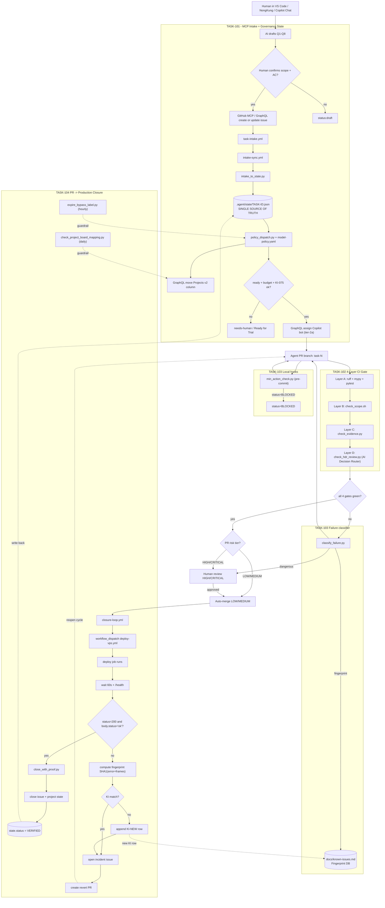
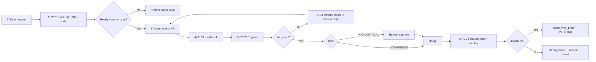

# Epic 1 - Orchestration & AI Agent Governance (Complete Redesign)

> Source spec: `D:\01_gitrepo\AI-Dev-Factory\docs\factory-gap-closure-governance.html`  
> Goal: Make AI agents capable of running the full `ai-accounting-copilot` PoC development to completion without runaway loops, fake done, scope creep, or token burn.  
> Control surface:
>
> - Issues: <https://github.com/YAHWAN-SHOP/ai-accounting-copilot/issues>
> - Project board: <https://github.com/orgs/YAHWAN-SHOP/projects/1/views/2>

---

## Section 0. What changed in this redesign

1. The operating mode is now explicit: users work mainly from VS Code, NongKung, Copilot Chat, and GitHub MCP/GraphQL.
2. GitHub Issue UI is supported but is not the primary path.
3. Current repo reality is explicit: `task-intake.yml`, `intake-sync.yml`, `intake_to_state.py`, and policy-based GraphQL assignment are design targets under TASK-101, not assumed-existing files.
4. Epic 1 now adds **TASK-104 (PR -> Production Closure)**.
5. Coverage expands from **12 pain points** to **18 pain points**.
6. Layer C is upgraded to **AI Decision Router**: AI reviews business-vs-code first, human is mandatory for HIGH/CRITICAL.

---

## Section 1. End-to-end operating model (TASK-101/102/103/104)



### Operator flow (short)



---

## Section 2. Pain point coverage (18/18)

| # | Pain point | Closed by | Mechanism | Status |
| --- | --- | --- | --- | --- |
| 1 | Context loss on long tasks | TASK-101 | `.agent/state/<id>.json` external memory | Policy |
| 2 | Forgetting requirements | TASK-101 | Issue form -> `acceptance_criteria[]` | Hard gate |
| 3 | Skipping details/scope guessing | TASK-101 | Q1-Q8 validation, missing AC/scope rejected | Hard gate |
| 4 | Cannot resume after crash | TASK-101 | persisted state + `max_loops` | Policy |
| 5 | Wrong model tier / cost blowout | TASK-101 | `model-policy.yaml` routing | Policy |
| 6 | Human bottleneck on every PR | TASK-102 | AI Decision Router auto-handles LOW/MEDIUM | Hard gate |
| 7 | Scope creep | TASK-102 | `check_scope.sh` | Hard gate |
| 8 | Fake/mock integration | TASK-102 | `check_evidence.py` requires raw docker/pytest evidence | Hard gate |
| 9 | Fake done / no real output | TASK-102 | AC-to-test pass binding in evidence | Hard gate |
| 10 | PR looks done but does not run | TASK-102 | quality pipeline (ruff/mypy/pytest) | Hard gate |
| 11 | Business logic mismatch | TASK-102 | AI review verdict ตรง/ไม่ตรง | Hard gate |
| 12 | Plan-only commits | TASK-103 | `min_action_check.py` pre-commit lock | Hard gate |
| 13 | Wrong-fix retry loop | TASK-103 | `classify_failure.py` dangerous/escalate routing | Hard gate |
| 14 | Wide-context token burn on fix | TASK-103 | narrow fix scope from classifier | Policy |
| 15 | PR merged but not deployed | TASK-104 | merge-triggered deploy dispatch | Hard gate |
| 16 | Deploy succeeded but unhealthy | TASK-104 | mandatory `/health` gate | Hard gate |
| 17 | Issue closed without proof | TASK-104 | close-with-proof required | Hard gate |
| 18 | Repeat failures without learning | TASK-104 | KI fingerprint lookup + append KI | Policy |

---

## Section 3. TASK-101 - Governance State + MCP Intake

**Owner**: DevOps/Governance  
**Risk**: MEDIUM  
**Duration**: ~2 days  
**Closes**: PP-1..PP-5

### TASK-102 Purpose

Convert a human request into a validated issue, committed state file, synchronized labels/project movement, and policy-based Copilot assignment.

### Q1-Q8 ownership

| Field | AI draft | Primary source | Human confirm |
| --- | --- | --- | --- |
| Q1 `task_id` | Yes | user text / next ID | if generated |
| Q2 `risk_tier` | Yes | policy + file risk + task type | required for HIGH/CRITICAL |
| Q3 `model_tier` | Yes | `model-policy.yaml` | when overriding policy |
| Q4 `allowed_scope` | Draft only | epic spec + repo paths | required |
| Q5 `forbidden_scope` | Draft only | policy defaults + sensitive paths | required |
| Q6 `acceptance_criteria` | Draft only | user intent + task spec | required |
| Q7 `max_loops` | Yes | default/cap policy | optional if default |
| Q8 `escalation_policy` | Yes | risk + category | required for bypass/security/deploy |

### TASK-102 Deliverables

```text
.agent/
├── README.md
├── state/
│   ├── _schema.json
│   └── TASK-<ID>.json
├── evidence/<TASK-ID>/
├── templates/
│   └── high-risk-advisory.md
└── logs/<TASK-ID>/

.github/
├── ISSUE_TEMPLATE/
│   ├── task-intake.yml
│   └── blocker.yml
└── workflows/
    └── intake-sync.yml

scripts/
├── agent_state.py
├── intake_to_state.py
└── governance/
    ├── policy_dispatch.py
    ├── project_graphql.py
    └── assign_copilot.py

tests/governance/
├── test_state.py
├── test_intake.py
└── test_policy_dispatch.py
```

### State schema (authoritative)

```json
{
  "task_id": "TASK-501",
  "issue_url": "https://github.com/.../issues/123",
  "project_item_id": "PVTI_xxx",
  "status": "PENDING|IN_PROGRESS|REVIEW_READY|BLOCKED|DONE",
  "risk_tier": "LOW|MEDIUM|HIGH|CRITICAL",
  "model_tier": "tier-1-opus|tier-2a-copilot|tier-2b-sonnet|tier-3-gemini",
  "allowed_scope": ["src/backend/ml/**", "tests/ml/**"],
  "forbidden_scope": [
    ".env*",
    "src/backend/auth/**",
    "src/backend/payments/**",
    "migrations/**",
    "config/secrets/**"
  ],
  "acceptance_criteria": [
    {
      "id": "ac_ocr_runs",
      "desc": "Tesseract returns text for sample PDF",
      "test": "test_ocr_runs_on_sample"
    },
    {
      "id": "ac_conf_score",
      "desc": "Output includes per-field confidence",
      "test": "test_confidence_attached"
    }
  ],
  "max_loops": 5,
  "run_count": 0,
  "last_action": "init",
  "last_modified_files": [],
  "blocker_reason": null,
  "escalation_policy": "human|ai-debate|stop",
  "created_at": "2026-06-06T00:00:00Z",
  "updated_at": "2026-06-06T00:00:00Z"
}
```

### MCP issue body contract (Q1-Q8)

```text
## Q1 Task ID
TASK-501

## Q2 Risk tier
MEDIUM

## Q3 Model tier
tier-2a-copilot

## Q4 Allowed scope
src/backend/ml/**
tests/ml/**
.agent/evidence/TASK-501/**

## Q5 Forbidden scope
private_data/**
.env*
config/secrets/**

## Q6 Acceptance criteria
ac_ocr_runs | sample PDF returns extracted text | test_ocr_runs_on_sample
ac_conf_score | each extracted field has confidence | test_confidence_attached

## Q7 Max loops
5

## Q8 Escalation policy
human
```

### Project board automation (Projects v2)

| Column | Trigger | Set by |
| --- | --- | --- |
| Backlog | issue created without `status:ready` | manual |
| Ready | label `status:ready` added | triager |
| In Progress | bot assigned or branch `task-<id>/*` pushed | `intake-sync.yml` |
| Review Ready | PR opened + all gates green | `agent_gate.yml` |
| Blocked | state `BLOCKED` or label `blocked` | gate/agent |
| Done | PR merged + close-with-proof | closure workflow |

GraphQL-only note: Copilot assignment must use GraphQL (KI-075 lesson); REST bot assignment returns 422.

### Acceptance criteria (TASK-101)

| ID | Condition | Test |
| --- | --- | --- |
| `ac_schema_valid` | schema validates sample state | `test_state_schema_validates` |
| `ac_init_state` | init creates valid state | `test_init_creates_valid_state` |
| `ac_intake_parse` | full Q1-Q8 body parses correctly | `test_intake_parses_all_fields` |
| `ac_intake_reject` | missing AC rejected with comment | `test_intake_rejects_missing_ac` |
| `ac_loop_limit` | `run_count >= max_loops` blocks | `test_max_loops_blocks` |
| `ac_resume` | resume from `last_action` works | `test_resume_from_state` |
| `ac_project_sync` | `IN_PROGRESS -> REVIEW_READY` moves card | `test_project_card_moves` |

---

## Section 4. TASK-102 - Four-Layer CI Gate Pipeline

**Owner**: DevOps/Governance  
**Risk**: HIGH  
**Duration**: ~3 days  
**Closes**: PP-6..PP-11

### TASK-104 Purpose

Implement hard CI gates in one workflow (`agent_gate.yml`) so every PR is merge-eligible only after all layers pass.

### TASK-104 Deliverables

```text
scripts/gates/
├── check_scope.sh
├── check_evidence.py
├── check_hdr_review.py
└── _common.py

.github/workflows/
└── agent_gate.yml

.github/prompts/
└── hdr-review.prompt.md

tests/gates/
├── test_check_scope.py
├── test_check_evidence.py
└── test_check_hdr_review.py
```

### Layer definition

| Layer | Script/step | Gate condition |
| --- | --- | --- |
| A - Scope Lock | `check_scope.sh` | changed files must be in `allowed_scope` and not in `forbidden_scope` |
| B - Evidence Lock | `check_evidence.py` | 3 evidence sections + AC/test pass binding |
| C - AI Decision Router | `check_hdr_review.py` | business/code verdict must be `ตรง`; risk policy enforced |
| D - Quality pipeline | ruff, mypy, pytest | lint/type/tests must pass |

### Evidence contract

Required file: `.agent/evidence/<TASK-ID>/evidence.md`

```markdown
## Commands Executed
$ pytest tests/ml/test_ocr.py -v
$ docker compose run --rm backend pytest ...

## Raw Output
<verbatim stdout/stderr>

## Acceptance Criteria
- [x] ac_ocr_runs (test_ocr_runs_on_sample) -- PASSED
- [x] ac_conf_score (test_confidence_attached) -- PASSED
```

Rules:

1. All sections must exist and be non-empty.
2. AC rows with `test` must have `<test_fn> .* PASSED` in raw output.
3. AC id prefix `int_` requires docker command evidence.
4. Backward compatibility: AC without `test` falls back to section-presence validation.

### AI Decision Router output

```json
{
  "verdict": "ตรง|ไม่ตรง",
  "business_logic_summary": "...",
  "code_logic_summary": "...",
  "mismatches": ["..."],
  "risk_final": "LOW|MEDIUM|HIGH|CRITICAL",
  "next_action": "approve|request_changes|escalate_human"
}
```

Hard rules:

1. `verdict=ไม่ตรง` -> gate FAIL + label `needs-rework`.
2. `risk_final=HIGH|CRITICAL` -> requires `approved-by-human` label.
3. typo/no-business-impact cases can be handled by AI without escalation.

### CI command order

```yaml
- ruff check src/ scripts/ tests/
- mypy scripts/ src/backend --ignore-missing-imports
- pytest -q --maxfail=1
- bash scripts/gates/check_scope.sh
- python scripts/gates/check_evidence.py
- python scripts/gates/check_hdr_review.py
```

Workflow concurrency: `gate-${{ github.event.pull_request.number }}`.

### Acceptance criteria (TASK-102)

| ID | Condition | Test |
| --- | --- | --- |
| `ac_scope_forbids_env` | touching `.env.local` fails | `test_scope_blocks_env` |
| `ac_scope_allows_in_scope` | in-scope-only PR passes | `test_scope_allows_in_scope` |
| `ac_evidence_missing_blocks` | missing raw output fails | `test_evidence_missing_blocks` |
| `ac_evidence_ac_binding` | missing AC/test binding fails | `test_ac_binding_enforced` |
| `ac_evidence_backward_compat` | AC without `test` still validates | `test_backward_compat` |
| `ac_hdr_ai_review_runs` | AI summary/verdict exists each PR | `test_hdr_ai_review_output` |
| `ac_hdr_mismatch_blocks` | verdict ไม่ตรง fails + labels | `test_hdr_mismatch_blocks` |
| `ac_workflow_runs_all` | steps run in correct order | `test_workflow_order` |

---

## Section 5. TASK-103 - Local Enforcement + Failure Classifier + Model Policy

**Owner**: DevOps/Governance  
**Risk**: MEDIUM  
**Duration**: ~2 days  
**Closes**: PP-12..PP-14

### TASK-103 Purpose

Stop bad commits before CI and classify CI failures so fix retries run with narrow context instead of full-repo context.

### TASK-103 Deliverables

```text
scripts/
├── min_action_check.py
├── classify_failure.py
├── run_gates.sh
├── setup-git-hooks.mjs
└── hooks/
    └── pre-commit

config/
├── model-policy.yaml
└── failure-categories.yaml

.github/workflows/
└── classify-on-failure.yml

tests/
├── test_min_action.py
└── test_classify_failure.py
```

### Action Lock (`min_action_check.py`)

```text
Pass if at least one staged file matches:
  src/**, tests/**, scripts/**, config/**, docker/**
Fail if everything staged is in:
  .agent/logs/**, **/*.md, .agent/state/** (without code)
Override:
  state.status=BLOCKED and evidence has "## Blocker"
```

Hook install:

```bash
node scripts/setup-git-hooks.mjs
```

### Failure classifier (`classify_failure.py`)

```json
{
  "category": "unit_test",
  "escalate_to_human": false,
  "suggested_fix_scope": [
    "src/backend/ml/extractor.py",
    "tests/ml/test_extractor.py"
  ],
  "evidence_excerpt": "FAILED ... AssertionError: ..."
}
```

Category policy in `config/failure-categories.yaml`:

| Category | Regex example | Escalate | Scope hint |
| --- | --- | --- | --- |
| `syntax` | `SyntaxError:` | no | traceback file |
| `lint` | `^[^\s]+\.py:\d+:\d+: [A-Z]\d+` | no | lint files |
| `type` | `error: .* \[(arg-type\|assignment)\]` | no | mypy files |
| `unit_test` | `FAILED tests/` | no | test + target module |
| `integration_test` | `FAILED tests/integration/` | no | test + service module |
| `docker` | `Cannot connect to the Docker daemon` | no | `docker/**` |
| `migration` | `alembic.util.exc\|InvalidMigration` | yes | n/a |
| `hmac_signature` | `hmac\|signature.*mismatch` | yes | n/a |
| `permission_auth` | `403\|401\|PermissionDenied` | yes | n/a |
| `unclear` | fallback | yes | n/a |

### Model policy extension

```yaml
tiers:
  tier-1-opus:
    model: claude-opus-4.7
    use: [architecture, rca, high_risk_review]
    max_calls_per_sprint: 3
  tier-2a-copilot:
    model: github-copilot
    use: [code, bugfix, tests, refactor]
    cost_per_call: 0
  tier-2b-sonnet:
    model: claude-sonnet-4.6
    use: [log_analysis, classify, evidence_check]
    context_policy: changed_files_plus_error_only
  tier-3-gemini:
    model: gemini-flash
    use: [docs, changelog, issue_classification]

hard_rules:
  free_models_for_gates: forbidden
  llm_can_final_merge_high_risk: false
  hard_gates: [ruff, mypy, pytest, check_scope, check_evidence, check_hdr_review, min_action]
```

### Acceptance criteria (TASK-103)

| ID | Condition | Test |
| --- | --- | --- |
| `ac_min_plan_only_rejected` | plan/log-only commit blocked | `test_plan_only_rejected` |
| `ac_min_real_change_passes` | real code+test changes pass | `test_real_change_passes` |
| `ac_min_blocked_override` | blocked override works | `test_blocked_override` |
| `ac_cf_migration_escalates` | migration errors escalate | `test_migration_escalates` |
| `ac_cf_hmac_escalates` | hmac/signature errors escalate | `test_hmac_escalates` |
| `ac_cf_type_no_escalate` | mypy errors are narrow-retry | `test_type_no_escalate` |
| `ac_cf_unit_scope` | unit-test fail gives narrow scope | `test_unit_scope` |
| `ac_cf_unknown_escalates` | unknown patterns escalate | `test_unknown_escalates` |
| `ac_policy_loads` | model policy validates | `test_policy_valid` |
| `ac_hooks_installed` | hook path set correctly | `test_hooks_installed` |

---

## Section 5.5 TASK-104 - PR to Production Closure Loop

**Owner**: DevOps/Governance  
**Risk**: MEDIUM  
**Duration**: ~1 day  
**Closes**: PP-15..PP-18

### Purpose

Enforce post-merge lifecycle: deploy dispatch, health verification, close-with-proof, incident/revert path, and known-issue fingerprint updates.

### Flow

```text
PR opened -> gates pass -> merge -> deploy dispatch -> /health -> state=VERIFIED -> closed-with-proof
Failure -> incident issue + revert when needed + KI fingerprint update
```

### Deliverables

```text
.github/workflows/
└── closure-loop.yml

scripts/governance/
├── close_with_proof.py
├── expire_bypass_label.py
└── check_project_board_mapping.py
```

### How it works

1. Merge into `main` triggers `closure-loop.yml`.
2. Deploy is dispatched automatically (`concurrency: deploy-main`).
3. Health gate runs `curl -fsS $DEPLOY_URL/health`; success requires HTTP 200 and `status=ok` within 60s.
4. On success, `close_with_proof.py` comments SHA + run URL + health timing, updates project state, and closes issue.
5. On failure, compute fingerprint `SHA1(error_signature + 3 stack frames)` and lookup in `docs/known-issues.md`.
6. Open incident, link KI if found, append `KI-NEW` if not found, create revert PR, and resume PR cycle.
7. Guardrails:
   - `expire_bypass_label.py` hourly removes stale `bypass:governance` labels older than 24h.
   - `check_project_board_mapping.py` daily detects Projects v2 status-column drift.

### Acceptance criteria (TASK-104)

| ID | Condition | Test |
| --- | --- | --- |
| `ac_deploy_dispatches` | deploy triggered within 60s after merge | `test_deploy_dispatches_on_merge` |
| `ac_health_required` | no VERIFIED before passing `/health` | `test_health_required_before_verified` |
| `ac_close_with_proof` | close comment contains SHA/run URL/health | `test_close_with_proof_posted` |
| `ac_revert_on_failure` | health fail opens incident + revert PR | `test_revert_on_health_fail` |
| `ac_bypass_expires` | stale bypass label removed with audit | `test_bypass_expires` |
| `ac_board_mapping_check` | mapping drift detected in daily run | `test_board_mapping_detected` |

---

## Section 6. Execution order (4 days)

```text
Day 1 AM   TASK-101  schema + agent_state.py + issue template
Day 1 PM   TASK-101  intake-sync.yml + policy_dispatch + GraphQL board/assign
Day 2      TASK-102  layers A/B/C + quality + agent_gate.yml + branch protection
Day 3 AM   TASK-103  min_action_check + pre-commit hook
Day 3 PM   TASK-103  classify_failure + classify-on-failure.yml + model-policy
Day 4      TASK-104  closure-loop + close_with_proof + bypass-expiry + board mapping
Day 4 EOD  End-to-end smoke test: TASK-501 full lifecycle
```

After Day 4, Epic 5 (Core Parser) becomes the first governed consumer: TASK-5xx issues are created via MCP/GraphQL intake, dispatched to tier-2a Copilot by policy, gated in CI, then closed only after deploy health and proof.

---

## Section 7. Definition of Done (Epic 1)

- [ ] `pytest tests/governance -q` green
- [ ] Seed issue `TASK-501` completes full flow: intake -> state -> board -> PR -> gates -> merge -> deploy -> health -> close-with-proof
- [ ] One intentionally bad PR is blocked by each gate layer
- [ ] `bypass:governance` labels auto-expire within 24h with audit comments
- [ ] Board mapping drift check catches renamed/missing status columns
- [ ] HIGH/CRITICAL work requires `approved-by-human` before merge
- [ ] `docs/AGENT-SKILL-CATALOG.md` updated with governance scripts
- [ ] `AGENTS.md` references questionnaire and `.agent/README.md`

---

## Section 7.5 Fast pilot readiness (ทำแค่นี้รอดไหม?)

Short answer: PoC fast pilot is viable if minimum guardrails are hard-enabled from day one. It is not viable if intake, bypass, or board automation remains fully manual.

### Minimum guardrails that must be active immediately

| Guardrail | Required behavior | If missing |
| --- | --- | --- |
| Forbidden paths | hard-fail for `private_data/**`, `.env*`, secrets, commercial data | risk of secret/customer-data leak |
| Evidence required | every PR must bind AC to real evidence | fake done merges |
| Bypass expiry | `bypass:governance` expires after 24h with audit | temporary bypass becomes permanent |

### Rollout switchboard

| Phase | Mode | Meaning | Exit condition |
| --- | --- | --- | --- |
| Day 0 | shadow | all gates comment; forbidden paths hard-fail | seed issue parses into valid state |
| Day 1 | hard | scope+evidence block merge | one good PR passes + one bad PR blocks |
| Day 2 | mixed | HDR AI review comments; HIGH/CRITICAL still human | false positives reviewed |
| Day 3+ | hard | full gate + board sync + assignment + closure loop | TASK-501 verified close-with-proof |

Warning: shadow mode is calibration-only. Epic 1 is production-ready only when state sync, evidence gate, board mapping checks, bypass expiry, and close-with-proof are all enforced.

---

## Section 8. Practical add-ons scaffolded

| File | Purpose | Mode |
| --- | --- | --- |
| `.agent/templates/high-risk-advisory.md` | 3-provider advisory template for HIGH/CRITICAL PRs | Manual/PR comment |
| `scripts/governance/expire_bypass_label.py` | expire stale bypass labels; supports dry-run and pagination | Hourly Actions |
| `scripts/governance/check_project_board_mapping.py` | verify status-column names/order; detect drift | Daily Actions |
| `.github/workflows/governance-watch.yml` | schedule hourly bypass expiry + daily board mapping checks | Actions cron |

---

## Section 9. Session alignment note

This file now reflects the complete structure and intent from `EPIC-1-DESIGN-new.html`, including:

1. TASK-104 closure lifecycle.
2. 18 pain points mapped to enforcement/policy.
3. AI Decision Router behavior in gate layer C.
4. Fast-pilot rollout and minimum guardrails.
5. Governance add-ons and recurring watchdog checks.

---

*Last updated: 2026-06-07 - Synced with `EPIC-1-DESIGN-new.html`*
